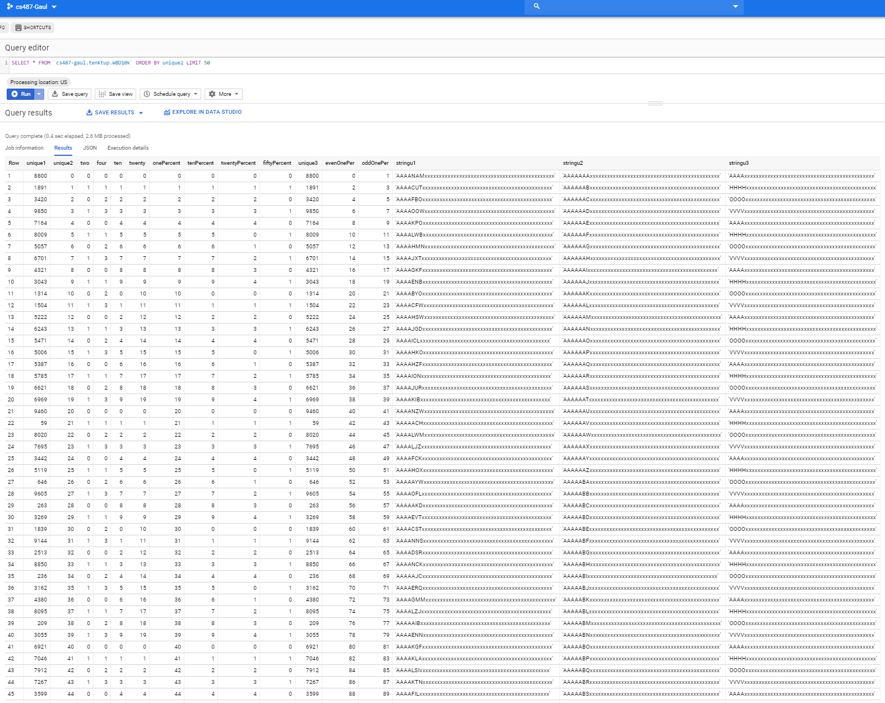
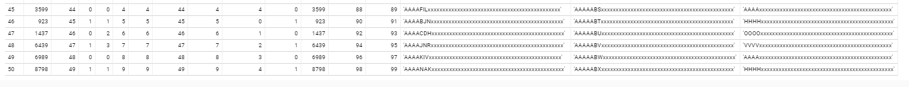

### IG

#### Purpose

Prints unique tuples in CSV according to the Wisconsin Benchmark scalable implementation.
#### Relation Generation
rel_gen.py takes number of desired unique tuples as only argument, or defaults to 10, max implemented 100 million.
	
	Note: Prints to terminal

##### Usage: 
with headers:
	
`python3 rel_gen.py 100000000 > someFile.txt`
	
without headers (any second arg disables headers):
	
`python3 rel_gen.py 100000000 n > someFile.txt`

Data compresses significantly(since its mostly 'x') for transfering.

#### Example Data

[tenktup.csv](https://github.com/igaul/wisconsonBenchmark/blob/master/tenktup.csv), [hunktup.csv](https://github.com/igaul/wisconsonBenchmark/blob/master/tenktupNoHeader.csv)
  

Sample of data uploaded to bigQuery:

#####
The code for generating the string data was adapted into Python from The Wisconsin Benchmark: Past, Present, and Future C example implementation. It can generate up to 267 unique tuples.

